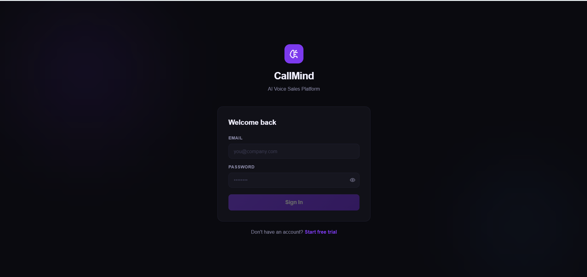
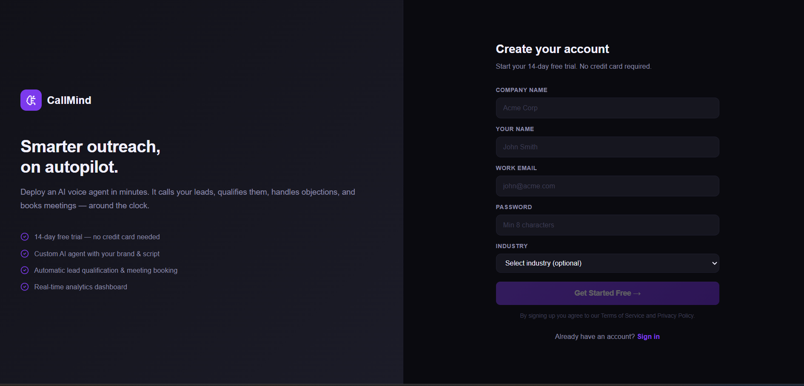
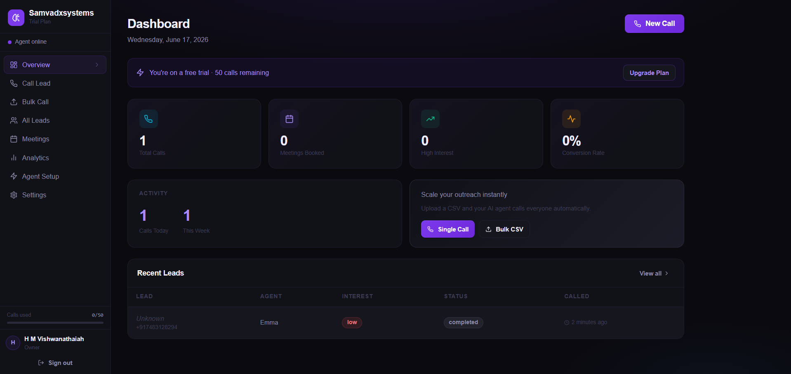
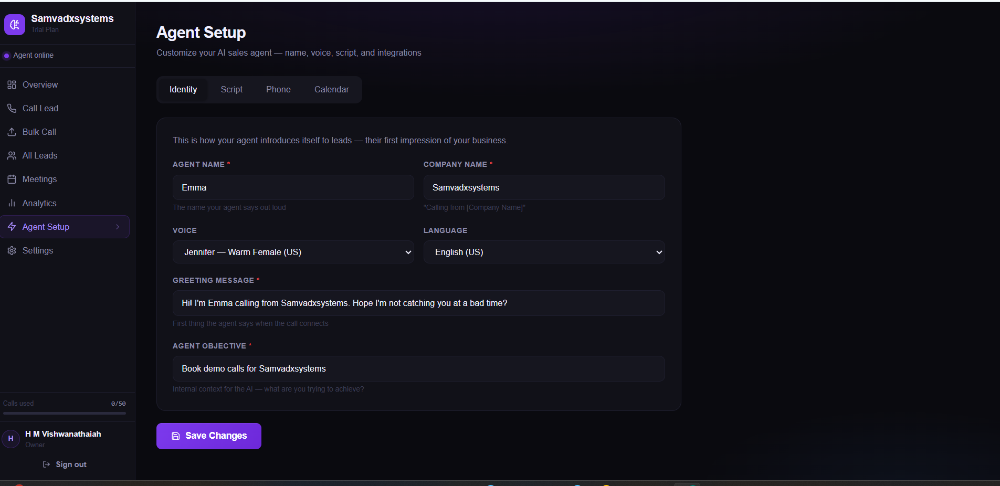
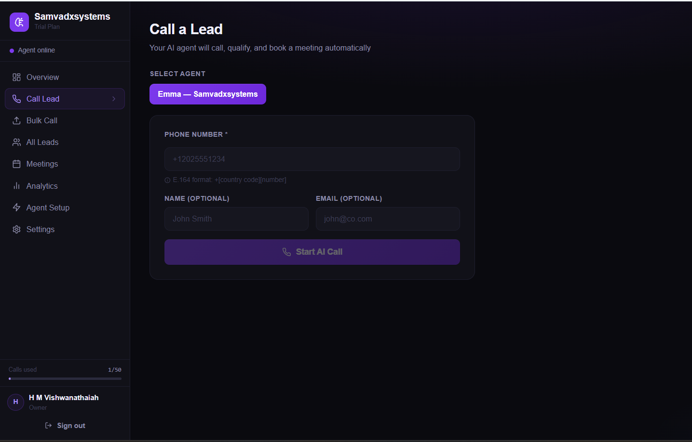
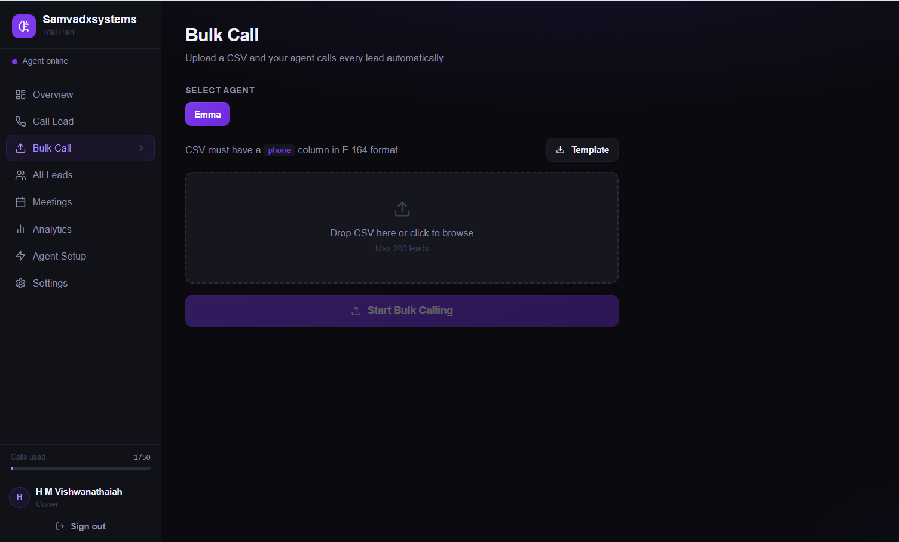
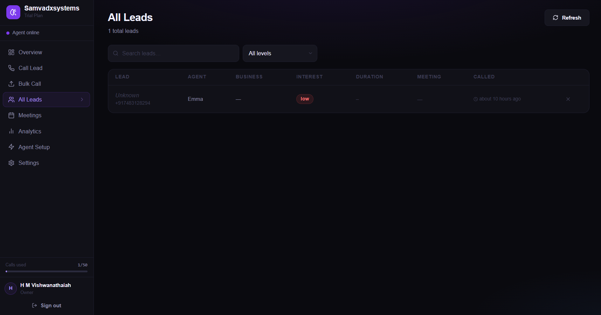
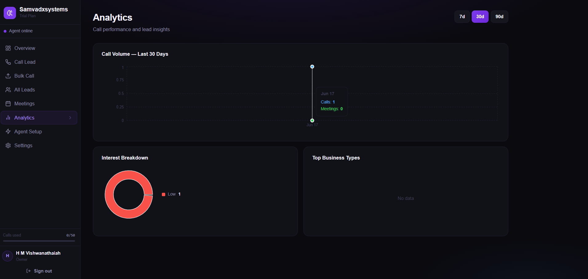
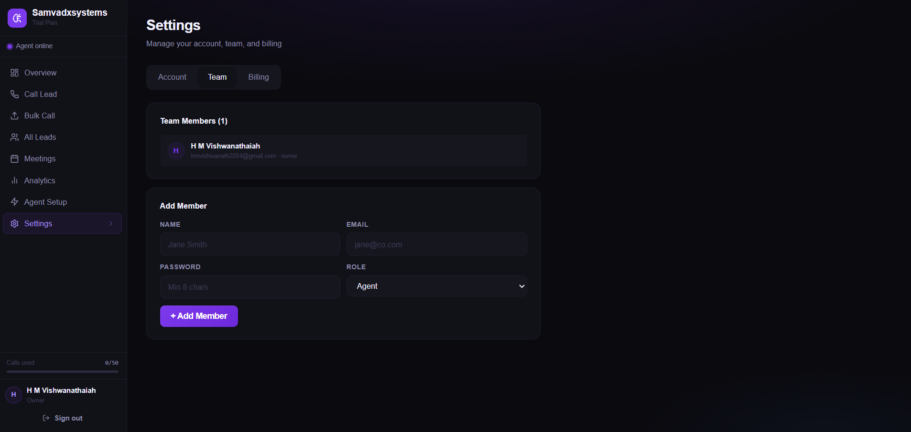
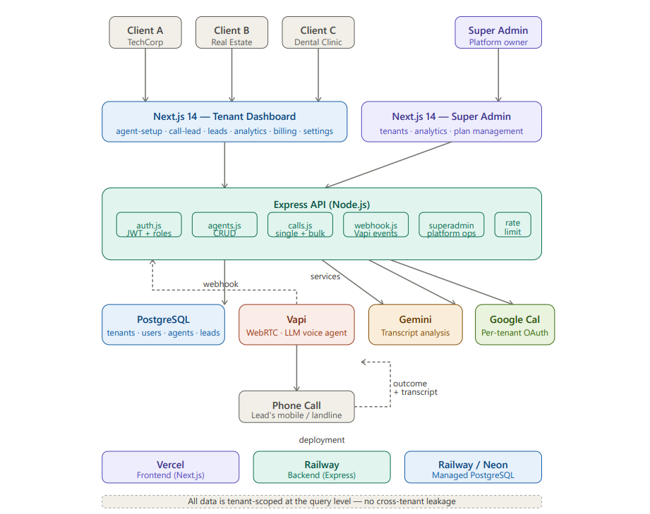

# CallMind — AI Voice Sales Platform

**Multi-tenant SaaS platform** where any business signs up, deploys their own AI voice agent, and automatically calls leads, qualifies them, and books meetings — 24/7, no human needed.

🔗 **Live Demo:** [voice-ai-call-agent.vercel.app](https://voice-ai-call-agent.vercel.app)  
🔗 **Backend API:** [voiceai-call-agent.onrender.com/health](https://voiceai-call-agent.onrender.com/health)

---

## Demo Video

> Click the thumbnail below to watch the full demo

[](docs/demo.mp4)

> If the video doesn't play inline, [click here to download and watch](docs/demo.mp4)

---

## Screenshots

### Login & Register



### Dashboard Overview


### Agent Setup


### Call Lead & Bulk Call



### Leads & Transcripts


### Analytics


### Settings


---

## System Architecture



### How It Works

```
Browser (Next.js — Vercel)
         │
         │  HTTPS REST API
         ▼
Express Backend (Node.js — Render)
         │                    │
         │                    │ Vapi API (initiate call)
         ▼                    ▼
  Neon PostgreSQL         Vapi Platform
  (Database)           (AI dials the number)
         ▲                    │
         │                    │ POST /api/webhook
         │◄───────────────────┘  (call ended + transcript)
         │
         │  Gemini AI
         │  (analyze transcript → extract name, email, interest)
         │
         ▼
   Google Calendar
   (auto-book meeting if interested)
```

---

## Tech Stack

| Layer | Technology |
|---|---|
| Frontend | Next.js 14 (App Router), TypeScript, Tailwind CSS |
| Backend | Node.js, Express.js |
| Database | PostgreSQL (Neon serverless) |
| Auth | JWT (jsonwebtoken), bcryptjs |
| AI Voice | Vapi.ai (Gemini 2.0 Flash model, Deepgram transcription) |
| AI Analysis | Google Gemini API |
| Calendar | Google Calendar API (OAuth2) |
| Hosting | Vercel (frontend) + Render (backend) |
| Security | Helmet.js, CORS, express-rate-limit |

---

## Key Features

- **Multi-tenant** — every business gets fully isolated data, agents, and analytics
- **Custom AI agent** — each client sets their own agent name, voice, script, qualifying questions
- **Auto-qualify leads** — AI extracts interest level, name, email from conversation
- **Auto-book meetings** — books Google Calendar events when lead says yes
- **Bulk calling** — upload CSV, AI calls everyone automatically
- **Real-time analytics** — conversion rates, call volume, interest breakdown
- **Plan management** — trial / starter / pro / enterprise with call limits
- **Super admin panel** — platform owner sees all tenants, usage, growth

---

## Multi-Tenant Architecture

```
CallMind Platform
├── Tenant: TechCorp
│   ├── Agent "Alex" — sells SaaS
│   ├── Their leads (isolated)
│   └── Their analytics
│
├── Tenant: Real Estate Co.
│   ├── Agent "Sarah" — books property tours
│   └── Completely separate data
│
└── Tenant: Dental Clinic
    ├── Agent "Mike" — books appointments
    └── Their own team & billing
```

Every DB query is scoped with `WHERE tenant_id = $1` — tenants can never see each other's data.

---

## Database Schema

```
tenants     — one row per business
  id (UUID), company_name, slug, plan, calls_used, calls_limit, trial_ends_at

users       — linked to a tenant (or superadmin with tenant_id = NULL)
  id (UUID), tenant_id, name, email, password_hash, role

agents      — AI agent config per tenant
  id (UUID), tenant_id, name, voice_id, greeting, objective,
  qualifying_questions, offer_text, calendar_pitch, vapi_phone_number_id

leads       — every call record, scoped to tenant
  id (UUID), tenant_id, agent_id, phone, name, email,
  interest_level, meeting_booked, transcript, call_summary, vapi_call_id
```

---

## Project Structure

```
callmind/
├── backend/
│   ├── server.js              # Express + security middleware
│   ├── db.js                  # PostgreSQL connection pool
│   ├── middleware/
│   │   ├── auth.js            # JWT verification + role checks
│   │   └── rateLimiter.js     # Per-endpoint rate limiting
│   ├── routes/
│   │   ├── auth.js            # signup, login, /me
│   │   ├── agents.js          # Agent CRUD
│   │   ├── calls.js           # Single call + bulk CSV
│   │   ├── leads.js           # Leads CRUD (tenant-scoped)
│   │   ├── meetings.js        # Meeting list
│   │   ├── analytics.js       # Charts data
│   │   ├── billing.js         # Plans + usage
│   │   ├── superadmin.js      # Platform admin routes
│   │   └── webhook.js         # Vapi webhook handler
│   └── services/
│       ├── vapiService.js     # Dynamic prompt builder + call initiator
│       ├── geminiService.js   # Transcript analysis
│       └── calendarService.js # Google Calendar OAuth2
│
├── frontend/
│   ├── app/
│   │   ├── login/             # Login page
│   │   ├── register/          # Signup (creates tenant + user)
│   │   ├── dashboard/         # Tenant dashboard
│   │   │   ├── agent-setup/   # Customize AI agent
│   │   │   ├── call-lead/     # Trigger single call
│   │   │   ├── bulk-call/     # CSV upload
│   │   │   ├── leads/         # Lead table + transcripts
│   │   │   ├── meetings/      # Booked meetings
│   │   │   ├── analytics/     # Charts
│   │   │   └── settings/      # Account + billing
│   │   └── superadmin/        # Platform owner panel
│   └── lib/
│       ├── api.tsx            # Auth context + typed API client
│       └── pages.tsx          # Dashboard page components
│
├── docs/
│   ├── screenshots/           # UI screenshots
│   └── architecture.png       # Architecture diagram
│
└── README.md
```

---

## Local Development

### 1. Install dependencies
```bash
npm run install:all
```

### 2. Set up environment
```bash
cp backend/.env.example backend/.env
cp frontend/.env.example frontend/.env.local
# Fill in backend/.env with your API keys
```

### 3. Run database migration
```bash
npm run migrate
# Creates all tables + prints your superadmin login
```

### 4. Start ngrok (Vapi needs a public URL)
```bash
ngrok http 4000
# Copy HTTPS URL → set as BACKEND_URL in backend/.env
# Set same URL in Vapi Dashboard → Settings → Server URL
```

### 5. Start both servers
```bash
npm run dev
```

- **Frontend:** http://localhost:3000  
- **Backend:** http://localhost:4000

---

## Deployment

### Backend → Render
1. Push repo to GitHub
2. Render → New Web Service → connect repo
3. Root Directory: `backend` | Build: `npm install` | Start: `node server.js`
4. Add all env vars from `backend/.env.example`
5. Run migration: Render Shell → `node scripts/migrate.js`

### Frontend → Vercel
1. Vercel → New Project → import repo
2. **Root Directory: `frontend`**
3. Add env var: `NEXT_PUBLIC_API_URL=https://your-render-url.onrender.com`
4. Deploy

### After both are live
- Set `FRONTEND_URL` in Render to your Vercel URL (fixes CORS)
- Set `BACKEND_URL` in Render to your Render URL (fixes Vapi webhook)
- Set Vapi webhook: `https://your-render-url.onrender.com/api/webhook`

---

## Pricing Model

| Plan | Calls/month | Price | Vapi Cost | Margin |
|---|---|---|---|---|
| Trial | 50 | Free | ~$5 | — |
| Starter | 500 | $49/mo | ~$25 | ~$24 |
| Pro | 2,000 | $149/mo | ~$100 | ~$49 |
| Enterprise | 10,000 | $499/mo | ~$500 | ~$0* |

---

## Built By

**H M Vishwanathaiah** 
[GitHub](https://github.com/vishwanathaiah2004)
